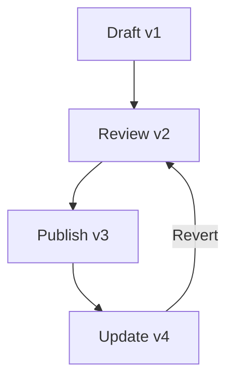

## Overview

yangheIDE provides a comprehensive set of tools for managing project documentation. You can create, organize, edit, and track changes across your documentation spaces efficiently. These core features streamline your workflow, from initial drafting to advanced collaboration and discovery.

<Callout kind="info">
  Customize these features to fit your project's needs. Start by exploring the editing tools to build rich content quickly.
</Callout>

## Key Features

Discover the essential capabilities at a glance.

<Columns cols={2}>
  <Card title="Document Editing" icon="edit-3" href="#document-editing">
    Rich formatting options including markdown, embeds, and real-time previews.
  </Card>
  <Card title="Space Organization" icon="folder" href="#space-organization">
    Hierarchical folder structures and intuitive navigation for large docs.
  </Card>
  <Card title="Version Control" icon="git-branch" href="#version-control">
    Track changes, revert edits, and collaborate with history timelines.
  </Card>
  <Card title="Search Tools" icon="search" href="#search-tools">
    Powerful full-text search and content discovery across spaces.
  </Card>
</Columns>

## Document Editing and Formatting

Edit documents with a full-featured WYSIWYG editor that supports markdown syntax, code blocks, and embeds.

<Tabs>
  <Tab title="Markdown" icon="code">
    Write in standard markdown for precise control.

````markdown
# Document Title

## Section

- List item
- Another item

```javascript
console.log("Hello, yangheIDE!");
```
````
  </Tab>
  <Tab title="Visual Editor" icon="edit">
    Drag-and-drop components for non-technical users.

    Use tables, images, and callouts without code.
  </Tab>
</Tabs>

<Callout kind="tip">
  Toggle between visual and markdown views anytime to combine strengths.
</Callout>

## Space Organization and Folder Structures

Organize your documentation into spaces and folders for scalability.

<Steps>
  <Step title="Create a Space" icon="plus">
    Click "New Space" in the sidebar and name it for your project.
  </Step>
  <Step title="Add Folders" icon="folder-plus">
    Drag documents into nested folders for logical grouping.
  </Step>
  <Step title="Share Access" icon="users">
    Set permissions at space or folder level.
  </Step>
</Steps>

## Version Control and History Tracking

Every edit creates a version you can browse or revert.



View diffs and restore previous states via the history panel.

<CodeGroup tabs="CLI,API">
````bash
yangheide version list --space=my-docs
yangheide version revert --id=abc123
````

````javascript
const response = await fetch('https://api.example.com/v1/spaces/my-docs/versions');
const versions = await response.json();
console.log(versions);
````
</CodeGroup>

## Search and Content Discovery

Find documents quickly with advanced search.

| Feature | Description |
|---------|-------------|
| Full-Text Search | Matches keywords across titles and content |
| Filters | By space, folder, or tags |
| Recent Views | Quick access to frequently used docs |

<Expandable title="Advanced Search Syntax" default-open="false">
  Use operators like `tag:api` or `from:2024-01-01`.
</Expandable>

## Get Started with Features

<Columns cols={3}>
  <Card title="Quickstart" icon="rocket" href="/quickstart">
    Set up your first space.
  </Card>
  <Card title="Authentication" icon="shield" href="/authentication">
    Secure your docs.
  </Card>
  <Card title="Changelog" icon="git-commit" href="/changelog">
    Latest updates.
  </Card>
</Columns>

<Callout kind="success">
  You've explored the core features. Experiment in a test space to see them in action.
</Callout>