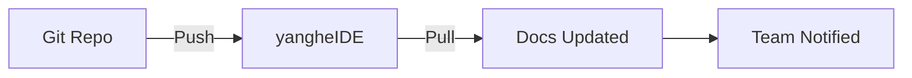

## Overview

yangheIDE supports seamless integrations with popular tools to streamline your documentation workflows. Sync changes with Git repositories, connect to collaboration apps like Slack and Jira, set up webhooks for real-time notifications, and export or import data in various formats.

<Columns cols={3}>
  <Card title="Git Sync" icon="git-branch" href="#git-sync">
    Keep your docs in sync with GitHub or GitLab repositories.
  </Card>
  <Card title="App Connections" icon="plug" href="#app-connections">
    Integrate with Slack, Jira, and more for team collaboration.
  </Card>
  <Card title="Webhooks" icon="zap" href="#webhooks">
    Receive instant notifications on doc updates.
  </Card>
</Columns>

<Callout kind="tip">
  Start with Git sync for version control, then add notifications via webhooks.
</Callout>

## Git Repository Synchronization

Connect yangheIDE to your Git provider to automatically sync documentation changes.

<Steps>
  <Step title="Connect Repository" icon="git-branch">
    Navigate to Settings > Integrations > Git Sync.
    
    Select your provider (GitHub, GitLab) and authorize the connection.
  </Step>
  <Step title="Configure Sync" icon="settings">
    Specify the repository URL and branch (e.g., `main`).
    
````yaml
sync:
  repo: https://github.com/your-org/your-docs.git
  branch: main
  path: docs/
````
  </Step>
  <Step title="Enable Auto-Sync" icon="play">
    Toggle auto-sync and test the connection.
    
    Push a change to your repo and verify it appears in yangheIDE.
  </Step>
</Steps>



## Third-Party App Connections

Connect yangheIDE to external apps for enhanced collaboration.

<Tabs>
  <Tab title="Slack" icon="message-circle">
    Send doc update notifications to Slack channels.
    
    <Steps>
      <Step title="Add Slack App">
        Go to Integrations > Slack and paste your webhook URL.
      </Step>
      <Step title="Test Notification">
````javascript
fetch('https://hooks.slack.com/services/YOUR/SLACK/WEBHOOK', {
  method: 'POST',
  body: JSON.stringify({
    text: 'New doc published in yangheIDE!'
  })
});
````
      </Step>
    </Steps>
  </Tab>
  <Tab title="Jira" icon="square">
    Link docs to Jira issues for better tracking.
    
    Use OAuth to connect your Jira instance.
    
    <ParamField header="Authorization" param-type="string" required="true">
      Bearer token from Jira API.
    </ParamField>
    
    <ParamField query="issue" param-type="string">
      Jira issue key (e.g., PROJ-123).
    </ParamField>
  </Tab>
</Tabs>

## Webhook Setup for Notifications

Set up webhooks to trigger actions on doc events like publishes or edits.

### Create Webhook

<Steps>
  <Step title="Generate Webhook URL" icon="link">
    In yangheIDE Settings > Webhooks, create a new webhook.
    
    Copy the generated URL: `https://api.yangheide.com/webhooks/your-webhook-id`.
  </Step>
  <Step title="Handle Events" icon="code">
    Implement an endpoint to receive payloads.
  </Step>
</Steps>

<CodeGroup tabs="Node.js,Python">
````javascript
app.post('/webhook', (req, res) => {
  const { event, docId, changes } = req.body;
  console.log(`Event: {event} for doc {docId}`);
  // Notify team or update external systems
  res.status(200).send('OK');
});
````
````python
from flask import Flask, request

app = Flask(__name__)

@app.route('/webhook', methods=['POST'])
def webhook():
    data = request.json
    event = data['event']
    doc_id = data['docId']
    print(f"Event: {event} for doc {doc_id}")
    return 'OK', 200
````
</CodeGroup>

<Callout kind="alert">
  Secure your webhook endpoints with HMAC signatures. Verify the `X-YangheIDE-Signature` header.
</Callout>

## Export and Import Formats

Export your documentation for backups or migration, and import from other tools.

| Format | Use Case | Supported |
|--------|----------|-----------|
| Markdown | Git repos, static sites | Yes |
| PDF | Printing, sharing | Yes |
| JSON | API imports | Yes |
| HTML | Web embedding | Yes |

<Expandable title="Advanced Export Options" default-open="false">
  Customize exports with filters:
  
````json
{
  "format": "markdown",
  "include": ["published"],
  "excludeTags": ["draft"]
}
````
</Expandable>

Integrate these features to build a powerful documentation pipeline tailored to your team.